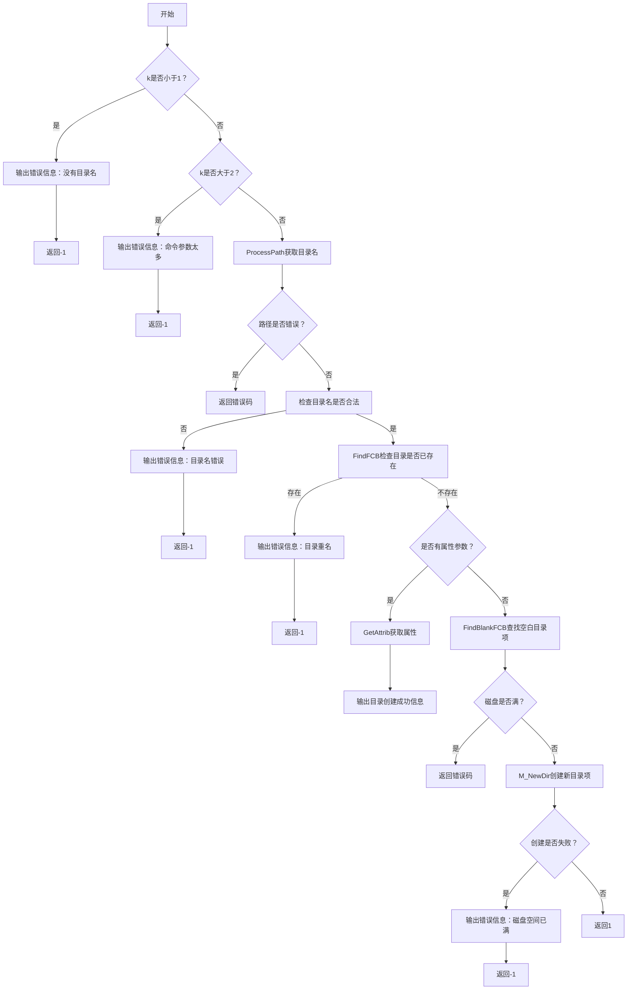
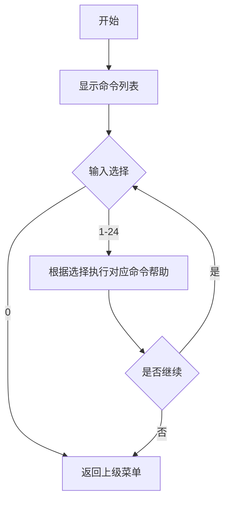
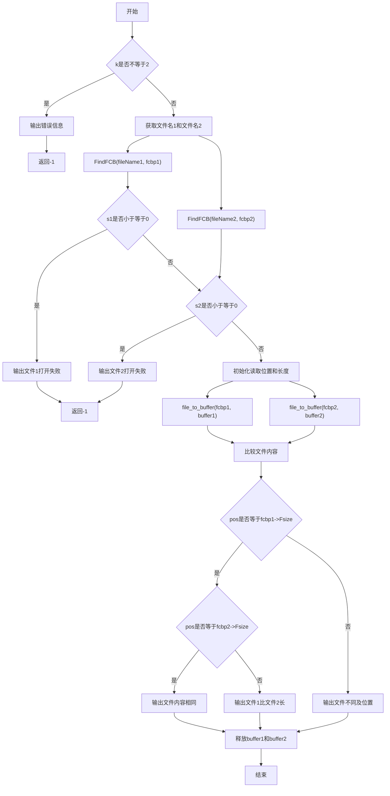
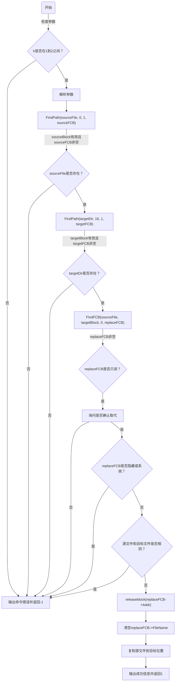
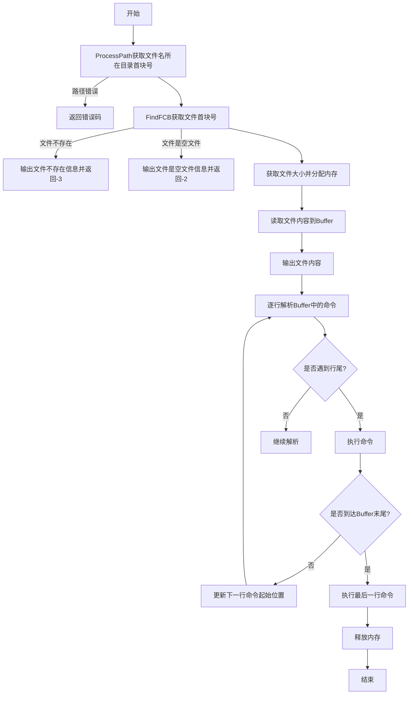
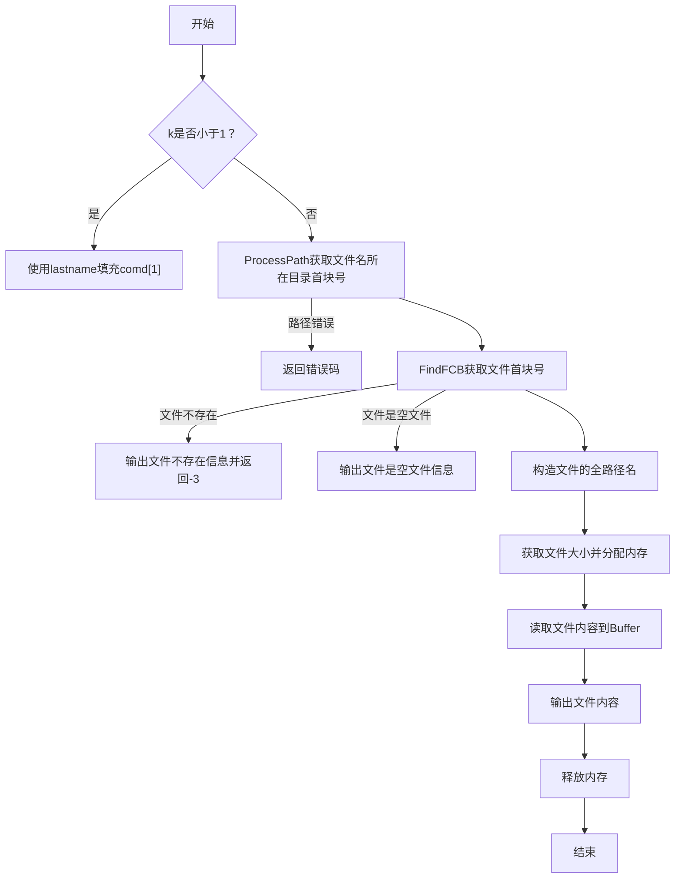

# 模拟操作系统实验报告

### 一、新设计的命令


#### 1.md

>只需要将第二个命令参数传入getAttrib函数进行解析
>
>然后把获取的属性保存下来

```
// 测试用例
md mt |rh
attrib mt
```

> 运行结果


```c++
//完整代码
int MdComd(int k)		//md命令处理函数
{
	// 命令形式：md <目录名>
	// 功能：在指定路径下创建指定目录，若没有指定路径，则在当前目录下创建指定目录。
	// 对于重名目录给出错误信息。目录与文件也不能重名。

	// 学生可以考虑命令中加“属性”参数，用于创建指定属性的子目录。命令形式如下：
	//		md <目录名>[ <属性>]
	// 属性包括R、H、S以及它们的组合(不区分大小写，顺序也不限)。例如：
	//		md user rh
	// 其功能是在当前目录中创建具有“只读”和“隐藏”属性的子目录user。

	short i,s,s0,kk;
    char attrib=(char)16,*DirName;
    FCB *p;

    kk=SIZE/sizeof(FCB);

	if (k<1)
	{
		cout<<"\n错误：命令中没有目录名。\n";
		return -1;
	}
	if (k>2)
	{
		cout<<"\n错误：命令参数太多。\n";
		return -1;
	}
	s=ProcessPath(comd[1],DirName,k,0,attrib);
	if (s<0)
		return s;		//失败，返回
	if (!IsName(DirName))		//若名字不符合规则
	{
		cout<<"\n命令中的新目录名错误。\n";
		return -1;
	}
	i=FindFCB(DirName,s,attrib,p);
	if (i>0)
	{
		cout<<"\n错误：目录重名！\n";
		return -1;
	}
	if (k==2)		//命令形式：md <目录名> |<属性符>
	{
		i=GetAttrib(comd[2],attrib);
		if (i<0)
			return i;
        cout<<"目录"<<comd[1]<<"创建成功,"<<"属性是"<<comd[2]<<endl;
	}
	s0=FindBlankFCB(s,p);//找空白目录项
	if (s0<0)			//磁盘满
		return s0;
	s0=M_NewDir(DirName,p,s,attrib);	//在p所指位置创建一新子目录项
	if (s0<0)		//创建失败
	{
		cout<<"\n磁盘空间已满，创建目录失败。\n";
		return -1;
	}
	return 1;		//新目录创建成功，返回
}
```

> 流程图




#### 2.Help

> 通过命令菜单显示所有的命令，并对其进行编号，通过读入控制台输入的序号，用switch语句进行判别

```
// 测试用例
help
2
0
```
> 运行结果


```c++
// 命令完整代码
void HelpComd()
{
    cout << "\n* * * * * * * * * 本系统主要的文件操作命令简述如下 * * * * * * * * *\n\n";
    cout << "请选择需要帮助的命令编号：\n";
    cout << "[1] create    [2] open      [3] write    [4] read\n";
    cout << "[5] close     [6] del       [7] dir      [8] cd\n";
    cout << "[9] md        [10] rd        [11] ren     [12] attrib\n";
    cout << "[13] copy      [14] type      [15] rewind  [16] fseek\n";
    cout << "[17] block     [18] closeall  [19] uof     [20] undel\n";
    cout << "[21] exit      [22] prompt    [23] fat      [24] check\n";
    cout << "[0] 返回上级菜单\n\n";

    int choice = 100;
    while(choice != 0)
    {
        cin >> choice;
        if(choice == 0)return;
        switch (choice)
        {
            case 1:
                cout << "create <文件名>[ <文件属性>] ——创建新文件,文件属性是r、h或s。\n";
                cout << "示例：create testfile.txt ——创建一个名为testfile.txt的新文件。\n";
                break;
            case 2:
                cout << "open <文件名> ——打开文件，操作类型可为r、h或(与)s。\n";
                cout << "示例：open testfile.txt ——打开名为testfile.txt的文件进行操作。\n";
                break;
            case 3:
                cout << "write <文件名> [<位置/app>[ insert]] ——在指定位置写文件(有插入功能)。\n";
                cout << "示例：write testfile.txt append ——在testfile.txt文件末尾追加内容。\n";
                break;
            case 4:
                cout << "read <文件名> [<位置m> [<字节数n>]] ——读文件，从第m字节处读n个字节。\n";
                cout << "示例：read testfile.txt 10 20 ——从testfile.txt的第10字节开始读取20个字节。\n";
                break;
            case 5:
                cout << "close <文件名> ——关闭文件。\n";
                cout << "示例：close testfile.txt ——关闭已打开的名为testfile.txt的文件。\n";
                break;
            case 6:
                cout << "del <文件名> ——撤消(删除)文件。\n";
                cout << "示例：del testfile.txt ——删除名为testfile.txt的文件。\n";
                break;
            case 7:
                cout << "dir [<路径名>] [|<属性>] ——显示当前目录。\n";
                cout << "示例：dir / ——显示根目录中的所有文件和子目录。\n";
                break;
            case 8:
                cout << "cd [<路径名>] ——改变当前目录。\n";
                cout << "示例：cd /usr ——切换到/usr目录。\n";
                break;
            case 9:
                cout << "md <路径名> [<属性>] ——创建指定目录。\n";
                cout << "示例：md /newdir ——在根目录下创建名为newdir的新目录。\n";
                break;
            case 10:
                cout << "rd [<路径名>] ——删除指定目录。\n";
                cout << "示例：rd /newdir ——删除名为newdir的目录。\n";
                break;
            case 11:
                cout << "ren <旧文件名> <新文件名> ——文件更名。\n";
                cout << "示例：ren oldfile.txt newfile.txt ——将oldfile.txt重命名为newfile.txt。\n";
                break;
            case 12:
                cout << "attrib <文件名> [±<属性>] ——修改文件属性(r、h、s)。\n";
                cout << "示例：attrib testfile.txt +r ——将testfile.txt设置为只读文件。\n";
                break;
            case 13:
                cout << "copy <源文件名> [<目标文件名>] ——复制文件。\n";
                cout << "示例：copy testfile.txt newfile.txt ——创建testfile.txt的副本newfile.txt。\n";
                break;
            case 14:
                cout << "type <文件名> ——显示文件内容。\n";
                cout << "示例：type testfile.txt ——显示testfile.txt的内容。\n";
                break;
            case 15:
                cout << "rewind <文件名> ——将读、写指针移到文件第一个字符处。\n";
                cout << "示例：rewind testfile.txt ——将testfile.txt的读写指针重置到文件开头。\n";
                break;
            case 16:
                cout << "fseek <文件名> <位置> ——将读、写指针都移到指定位置。\n";
                cout << "示例：fseek testfile.txt 30 ——将testfile.txt的读写指针移动到第30个字节。\n";
                break;
            case 17:
                cout << "block <文件名> ——显示文件占用的盘块号。\n";
                cout << "示例：block testfile.txt ——显示testfile.txt占用的盘块号。\n";
                break;
            case 18:
                cout << "closeall ——关闭当前打开的所有文件。\n";
                cout << "示例：closeall ——关闭所有已打开的文件。\n";
                break;
            case 19:
                cout << "uof ——显示UOF(用户打开文件表)。\n";
                cout << "示例：uof ——显示当前用户打开的所有文件的列表。\n";
                break;
            case 20:
                cout << "undel [<路径名>] ——恢复指定目录中被删除的文件。\n";
                cout << "示例：undel /usr ——恢复/usr目录中被删除的文件。\n";
                break;
            case 21:
                cout << "exit ——退出本程序。\n";
                cout << "示例：exit ——退出文件管理系统。\n";
                break;
            case 22:
                cout << "prompt ——提示符是否显示当前目录(切换)。\n";
                cout << "示例：prompt ——切换提示符是否显示当前目录的状态。\n";
                break;
            case 23:
                cout << "fat ——显示FAT表中空闲盘块数(0的个数)。\n";
                cout << "示例：fat ——显示当前磁盘上的空闲块数。\n";
                break;
            case 24:
                cout << "check ——核对后显示FAT表中空闲盘块数。\n";
                cout << "示例：check ——核对并显示空闲盘块数。\n";
                break;
            case 0:
                // 返回上级菜单的逻辑可以在这里实现
                break;
            default:
                cout << "无效的选择，请重新输入。\n";
                break;
        }
    }
}
```

> 流程图




####  3.Fc

> 该命令的实现先要通过FindFCB()函数找到两个文件各自对应的FCB结构体指针，
>
> 然后通过file_to_buffer()函数将文件内容读取到buffer数组中，
>
> 通过“双指针”对buffer数组里的每一个元素挨个对比，如果出现不一样的内容，就break掉循环，返回不一样的位置

```
// 测试用例
create t1
write t1
asd
create t2
write t2
ase
fc t1 t2
```

> 运行结果


```c++
// 命令完整代码
int FcComd(int k) {
    if (k != 2) {
        cout << "\n命令参数错误：需要两个文件名作为参数。\n";
        return -1;
    }

    char *fileName1 = comd[1];
    char *fileName2 = comd[2];

    // 获取两个文件的FCB指针
    FCB *fcbp1, *fcbp2;
    int s1 = FindFCB(fileName1, curpath.fblock, '\040', fcbp1); // 假设文件在当前目录
    int s2 = FindFCB(fileName2, curpath.fblock, '\040', fcbp2); // 假设文件在当前目录

    if (s1 <= 0 || s2 <= 0) {
        if (s1 <= 0) cout << "\n文件 " << fileName1 << " 打开失败。\n";
        if (s2 <= 0) cout << "\n文件 " << fileName2 << " 打开失败。\n";
        return -1;
    }

    // 初始化文件内容读取位置
    int pos1 = 0, pos2 = 0;
    int len1 = fcbp1->Fsize;
    int len2 = fcbp2->Fsize;
    int isDifferent = 0;
    int diffPos = 0;

    // 读取文件内容
    char* buffer1 = new char[fcbp1->Fsize + 1];
    char* buffer2 = new char[fcbp2->Fsize + 1];
    file_to_buffer(fcbp1, buffer1);
    file_to_buffer(fcbp2, buffer2);

// 比较文件内容
    int pos = 0;
    while (pos < fcbp1->Fsize && pos < fcbp2->Fsize) {
        if (buffer1[pos] != buffer2[pos]) {
            break;
        }
        pos++;
    }

    if (pos == fcbp1->Fsize && pos == fcbp2->Fsize) {
        cout << "\n文件内容相同。\n";
    }
    else {
        if (pos < fcbp1->Fsize && pos < fcbp2->Fsize) {
            cout << "\n文件不同，在第 " << pos + 1 << " 个字符：";
            cout << "文件1是 " << buffer1[pos] << "，文件2是 " << buffer2[pos] << endl;
        }
        else if (pos < fcbp1->Fsize) {
            cout << "\n文件1比文件2长。\n";
        }
        else {
            cout << "\n文件2比文件1长。\n";
        }
    }

    delete[] buffer1;
    delete[] buffer2;
    return 1;


}
```

> 流程图




#### 4.Replace

> 这个命令要实现同名文件的替换，首先要找到两个文件对应的磁盘块
>
> 然后将FCB的信息进行复制

```
replace boy usr
cd usr 
type boy

// 若指定文件或被取代文件不存在，则报错
replace re usr

// 若被取代的是只读属性的文件时，应询问用户
create re r
write re
 qwer
cd usr
create re r
write re 
1234
cd ..
replace re usr
cd usr
type re
```

> 运行结果


```c++
// replaceComd完整代码
int ReplaceComd(int k) {
    if (k < 1 || k > 2) {
        cout << "\n命令错误：参数数量错误。\n";
        return -1;
    }

    char sourceFile[PATH_LEN];
    char targetDir[PATH_LEN];
    FCB *sourceFCB = nullptr, *targetFCB = nullptr;
    short sourceBlock, targetBlock;

    // 解析参数
    strcpy(sourceFile, comd[1]);
    if (k == 2) {
        strcpy(targetDir, comd[2]);
    } else {
        strcpy(targetDir, curpath.cpath); // 若目录名缺省，则默认为当前目录
    }

    // 找到源文件
    sourceBlock = FindPath(sourceFile, 0, 1, sourceFCB);
    if (sourceBlock < 1 || sourceFCB == nullptr) {
        cout << "\n错误：源文件 " << sourceFile << " 不存在。\n";
        return -1;
    }

    // 检查目标目录是否存在
    targetBlock = FindPath(targetDir, 16, 1, targetFCB);
    if (targetBlock < 1 || targetFCB == nullptr) {
        cout << "\n错误：目标目录 " << targetDir << " 不存在。\n";
        return -1;
    }

    // 在目标目录中查找同名文件
    FCB *replaceFCB = nullptr;
    if (FindFCB(sourceFile, targetBlock, 0, replaceFCB) < 0 || replaceFCB == nullptr) {
        cout << "\n错误：目标目录中没有同名文件。\n";
        return -1;
    }

    // 检查属性
    if (replaceFCB->Fattrib & 1) {
        char confirm;
        cout << "\n目标文件是只读文件，是否确认取代？(y/n): ";
        cin >> confirm;
        if (confirm != 'y' && confirm != 'Y') {
            cout << "\n操作已取消。\n";
            return -1;
        }
    }
    if (replaceFCB->Fattrib & (2 | 4)) {
        cout << "\n错误：目标文件具有隐藏或系统属性，不能取代。\n";
        return -1;
    }

    // 防止自取代
    if (sourceBlock == replaceFCB->Addr) {
        cout << "\n错误：源文件和目标文件是同一文件，不能自取代。\n";
        return -1;
    }

    // 删除目标文件
    releaseblock(replaceFCB->Addr);
    replaceFCB->FileName[0] = '\0'; // 清空目录项

    // 复制源文件到目标位置
    replaceFCB->Addr = sourceFCB->Addr;
    replaceFCB->Fsize = sourceFCB->Fsize;
    strcpy(replaceFCB->FileName, sourceFCB->FileName);
    replaceFCB->Fattrib = sourceFCB->Fattrib;

    cout << "\n文件 " << sourceFile << " 成功取代目标目录 " << targetDir << " 中的同名文件。\n";
    return 1;
}
```

> 流程图




#### 5.Batch

> 先获取首块号
>
> 读取Disk数组也就是虚拟磁盘空间
>
> 调用函数进行解析和执行

```
// 测试样例
create ba
write ba
cd /usr \n dir \n type boy \n md te |r
batch ba
```

> 运行结果


```c++
// 完整代码
int BatchComd() {

    short int len, j = 0;


    short i, s, size, jj = 0;
    char attrib = '\0', *FileName;
    char *Buffer;
    char gFileName[PATH_LEN];    //存放文件全路径名
    FCB *fcbp;

    s = ProcessPath(comd[1], FileName, 2, 0, '\020');//取FileName所在目录的首块号
    if (s < 1)            //路径错误
        return s;        //失败，返回
    s = FindFCB(FileName, s, attrib, fcbp);        //取FileName的首块号(查其存在性)
    strcpy(gFileName, temppath);
    i = strlen(temppath);
    if (temppath[i - 1] != '/')
        strcat(gFileName, "/");
    strcat(gFileName, FileName);    //构造文件的全路径名
    if (s < 0) {
        cout << "\n文件" << gFileName << "不存在。\n";
        return -3;
    }
    if (s == 0){
        cout << "\n文件" << gFileName << "是空文件\n";
        return -2;
    }
    else {
        size = fcbp->Fsize;
        Buffer = new char[size + 1];        //分配动态内存空间
        while (s > 0) {
            for (i = 0; i < SIZE; i++, jj++) {
                if (jj == size)
                    break;
                Buffer[jj] = Disk[s][i];
            }
            if (i < SIZE)
                break;
            s = FAT[s];
        }
        Buffer[jj] = '\0';
        cout<<Buffer<<endl;
    }
    // 逐行解析并执行命令
    len = strlen(Buffer);
    for (i = 0; i < len; i++) {
        if (Buffer[i] == '\n') { // 遇到行尾，执行命令
            Buffer[i] = '\0'; // 替换行尾符为字符串结束符w
//            if (j > 0 && Buffer[j - 1] != '\0') { // 确保命令非空

                int k = ParseCommand(Buffer + j); // 解析命令
                ExecComd(k); // 执行命
//            }
            j = i + 1; // 更新下一行命令的起始位置
        }
    }

    // 执行最后一行命令
    if (j < len && Buffer[j] != '\0') {
        int k = ParseCommand(Buffer + j);
        if (k >= 0) {
            ExecComd(k);
        }
    }

    // 释放内存
    delete[] Buffer;
    return 1;

}
```

> 流程图




#### 6.Close Type

> 只需要在执行write create 等命令后，用全局变量记录执行的文件的名字即可
>
> 然后将文件名赋给comd数组，再进行完整命令的解析

```
// 测试样例
create ct
write ct
qwer
type
close
```

> 运行结果


``` c++
// 核心代码
	if(k<1)
	{
        for(int i = 0;lastname[i] != '\0';i++){comd[1][i] = lastname[i];}
	}
```

> 流程图


